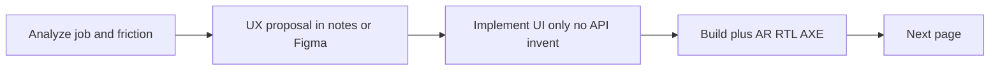

# Account SPA — UX redesign plan (page-by-page)

## Why this plan exists

The recent shared-UI work aligned **visual chrome** (CRM kit, Lama Sans, buttons). That does **not** fix **UX**: cognitive load, unclear next actions, dense dialogs, and journeys that require domain expertise.

This plan treats each surface as: **understand the job → list friction → redesign for clarity → ship**.

**Non-negotiables (unchanged):** cookie session + CSRF, login decision tree, permissions gate actions not routes, onboarding purchase contract, global error banner, AR/RTL, Signal Forms.

**Success criteria (every page):**
1. A first-time user can finish the primary job without reading docs.
2. Secondary jobs are ≤2 clicks from the primary surface.
3. One clear primary CTA; destructive actions are confirmed and labeled.
4. Empty / loading / error / success states explain what to do next.
5. Mobile/RTL: same jobs work without horizontal puzzle scrolling.

---

## Phase 0 — UX foundation (before page redesigns)

**Goal:** Shared language so page work does not invent five patterns.

| Deliverable | Detail |
|-------------|--------|
| Journey map | Register → set-password → login → select-company → onboarding → applications home → admin tasks |
| Mental model | Account = SSO hub + tenant admin; CRM/HR are products you *open*, not manage here |
| Interaction kit | When to use table vs cards vs tree; when dialog vs drawer vs full page; wizard steps max 3 |
| Copy principles | Verb-first CTAs; avoid “catalog / key / resource” in user copy unless needed; bilingual AR/EN parity |
| IA check | Sidebar order vs frequency; which pages are “admin only” vs “everyone” |

**Exit:** Short `docs/UX-PRINCIPLES.md` (1–2 pages) + agreed page order below.

---

## Page inventory & priority

| Priority | Route / surface | Primary user job |
|----------|-----------------|------------------|
| P0 | Login, Register, Set/Forgot/Reset password | Get in / recover access |
| P0 | Select company | Pick the right tenant under intent |
| P0 | Onboarding (company → package → payment → results) | Activate tenant & pay if needed |
| P0 | Applications (home) | Open the right Brooch app |
| P1 | Members (+ invite / detail / edit roles) | Invite people & grant access |
| P1 | Roles (+ form / details / permission tree) | Define what roles can do |
| P1 | Teams (+ org chart / details / assign) | Structure people into teams |
| P2 | My Access | Understand “what can *I* do?” |
| P2 | Account | Profile, switch company, sessions, logout |
| P2 | Permissions | Browse what permissions exist (reference) |
| P3 | Access denied / Denied / Session expired | Recover from a dead end |

---

## Phase 1 — First-run auth (P0)

### 1.1 Login
- **Job:** Sign in; honor intent / onboarded banners; land correctly (company picker vs redirect vs home).
- **Friction:** Multiple banners compete; password + email density; unclear “why am I here?” when coming from CRM.
- **Redesign:** One status banner max; intent message as the lead when present; stronger “continue to {app}” framing; keep form short.

### 1.2 Register
- **Job:** Create tenant owner account (no password yet).
- **Friction:** Form feels like “full signup” then email surprise.
- **Redesign:** Explicit next-step copy (“We’ll email a set-password link”); progress of “1 of 2”.

### 1.3 Set / Forgot / Reset password
- **Job:** Complete password with code/token without getting lost.
- **Friction:** Code + password fields can feel like OTP product (we have no OTP story).
- **Redesign:** Label codes as “email code”, show expiry/help, single column, success → clear path to login.

### 1.4 Select company
- **Job:** Choose one membership from `availableCompanies` only.
- **Friction:** Empty list dead-end; intent banner easy to miss; cards don’t show “why pick this one”.
- **Redesign:** Larger company name, membership role/status chip, last-used if available; empty state with one action; busy state on the chosen card only.

### 1.5 Denied / Access denied / Session expired
- **Job:** Explain + one recovery path.
- **Friction:** Similar pages; weak distinction.
- **Redesign:** Distinct titles/icons; always one primary button (login / home / support); no duplicate jargon.

**Exit Phase 1:** First-run journey completable in AR + EN without support; AXE on login + select-company.

---

## Phase 2 — Onboarding & payment (P0)

### 2.1 Company step
- **Job:** Name the company (AR + EN).
- **Friction:** Feels like “settings” not “activate workspace”.
- **Redesign:** Hero framing “Name your company”; why two languages; stepper progress that matches mental model.

### 2.2 Package step
- **Job:** Pick a package; `POST /subscriptions` decides free vs paid.
- **Friction:** Price vs free vs trial vs unavailable mixed; catalogue `requiresPayment` vs response flag confusion for users (copy must follow server flags).
- **Redesign:** Card hierarchy: name → price/trial → apps included → CTA (“Start free” / “Continue to payment”); unavailable cards visually secondary with reason.

### 2.3 Payment + results
- **Job:** Tokenize card → pay → verify → land on done/failed/processing.
- **Friction:** Processing/return/failed states feel technical; reopen/retry unclear.
- **Redesign:** Plain-language status screens (“Confirming payment…”, “You’re in”, “Payment didn’t go through — try again”); single CTA each; never imply redirect = success.

**Exit Phase 2:** Happy path + failed path + reauth path understood without reading `ONBOARDING_FRONTEND_GUIDE.md`.

---

## Phase 3 — Home & shell (P0/P1)

### 3.1 Applications (launcher home)
- **Job:** Open CRM/HR/Account or understand why locked.
- **Friction:** Locked apps look broken; SSO hint buried; “current” vs “open” competing.
- **Redesign:** Primary = Open; locked = “Not included in your plan” + link to account/support if appropriate; current app as quiet badge; reduce decorative noise.

### 3.2 Shell (header + sidebar)
- **Job:** Navigate, switch company, theme/lang, logout.
- **Friction:** Nav labels may not match jobs; company switcher discoverability; too many admin links for members who only need My Access + Apps.
- **Redesign:** Nav grouped (Work / Admin); hide or demote admin links when user lacks manage perms (still no route guards — just IA); company switcher label clarity.

**Exit Phase 3:** New owner lands on Applications and knows what to click next.

---

## Phase 4 — Members (highest admin UX debt) (P1)

### 4.1 Members list
- **Job:** Find a person; see status; invite; open detail.
- **Friction:** Stats may not help search; row actions icon-only without strong labels; pending vs active easy to miss.
- **Redesign:** Search-first; status filter as chips; row shows name/email/status/roles summary; actions with tooltips + ARIA; empty state “Invite your first teammate”.

### 4.2 Invite dialog (critical)
- **Job:** Invite email + grant apps/roles/teams.
- **Friction:** All-in-one mega form (identity + apps + roles + teams + review) = high drop-off.
- **Redesign options (pick one in analysis):**
  - **A.** True 3-step wizard: Identity → Access → Review (one step visible).
  - **B.** Invite with email only → “Set access later” from detail (faster invite).
- Prefer **A** if backend requires roles at invite; **B** if API allows invite without roles.

### 4.3 Detail / edit roles
- **Job:** See membership; change roles; remove.
- **Friction:** Two overlays; edit-roles reuses dense app/role lists.
- **Redesign:** One member panel (drawer): overview | access | danger zone; edit access inline or single focused dialog.

**Exit Phase 4:** Owner can invite + grant access in &lt;2 minutes without training.

---

## Phase 5 — Roles & permission tree (P1)

### 5.1 Roles list
- **Job:** Find/create roles; see active vs system/owner.
- **Friction:** Cards hide density for admins; owner/system rules opaque.
- **Redesign:** Table or compact list (app | name | type | status | perms count | actions); legend for Owner / System / Custom; create CTA only when apps exist.

### 5.2 Role form + permission tree
- **Job:** Name role; pick grants within grant scope.
- **Friction:** Tree is powerful but scary; locked vs selected vs available unclear; search + expand tools buried.
- **Redesign:** Start collapsed by module; “Recommended” presets if feasible without new API; clear locked reason; sticky summary (“12 permissions”); save enabled only when valid.

### 5.3 Role details
- **Job:** View; edit if allowed; deactivate.
- **Friction:** Protected roles look editable until click fails.
- **Redesign:** Read-only mode for immutable roles; actions only when `canEdit` is true.

**Exit Phase 5:** Creating a custom role is guided; viewing owner role never offers forbidden edits.

---

## Phase 6 — Teams (P1)

### 6.1 Org chart page
- **Job:** See structure; open a team; create root/subteam.
- **Friction:** Chart hard on mobile; deep trees = scroll maze; create/manager/member flows split across modals.
- **Redesign:** Desktop: keep chart *or* offer list/tree toggle. Mobile: indented list default. Node click → details. Create from empty state + from selected node.

### 6.2 Team details / form / assign
- **Job:** Edit team; set manager; add members; add subteam.
- **Friction:** Multiple small dialogs; depth limit surprises.
- **Redesign:** One details sheet with tabs (Overview / Members / Subteams); depth warning before create; assign member as searchable list.

**Exit Phase 6:** User builds a 3-level tree and assigns a manager without getting stuck.

---

## Phase 7 — My Access, Account, Permissions (P2)

### 7.1 My Access
- **Job:** Answer “what can I do in each app?”
- **Friction:** Raw permission keys; stats not meaningful; hint panel ignored.
- **Redesign:** Group by app → human permission names; collapse keys behind “Technical details”; optional “You have an admin role” summary.

### 7.2 Account
- **Job:** See me; switch company; review sessions; sign out everywhere.
- **Friction:** Three jobs on one scroll; sessions scary.
- **Redesign:** Profile card → Companies (switch) → Security (sessions + logout-all) as clear sections; confirm logout-all.

### 7.3 Permissions (catalog)
- **Job:** Reference for admins building roles (not day-to-day).
- **Friction:** Looks like a third “access” product next to Roles + My Access.
- **Redesign:** Position as “Permission dictionary”; search; link from Roles empty/help; or demote in nav under Roles.

**Exit Phase 7:** Users stop confusing Permissions vs Roles vs My Access.

---

## Phase 8 — Cross-cutting polish (P3)

- Empty/error/success consistency across all pages.
- Focus management after dialogs and navigation.
- AXE + RTL spot-check on redesigned P0–P1.
- Copy pass AR/EN for new microcopy.
- Remove leftover patterns that fight the interaction kit (mega-dialogs, icon-only without labels).

---

## Working method (every page phase)

1. **Analyze (½–1 day):** Write “Job / Current steps / Friction / Ideal steps” for that page into the phase notes.
2. **Design:** Wireframe or annotated screenshot; get agreement on wizard vs single page.
3. **Implement:** Visual + interaction; keep `*Api` contracts.
4. **Verify:** `ng build`, AR/RTL, keyboard, AXE smoke.
5. **Ship:** One page (or one dialog family) per PR on a UX branch.

---

## Suggested execution order (next sessions)

1. Phase 0 principles (short)
2. Phase 4 Members invite (biggest daily pain) *or* Phase 1 auth if first-run metrics matter more
3. Phase 5 Roles tree
4. Phase 6 Teams mobile/list mode
5. Phase 2 onboarding clarity
6. Phase 3 Applications + shell IA
7. Phase 7 reference pages
8. Phase 8 polish

---

## Out of scope

- New backend endpoints or changing authz/payment contracts
- Replacing ngx-translate or Signal Forms
- Building a separate design system package (reuse CRM kit tokens)

## Relation to prior “full UI redesign” plan

That plan finished **visual parity**. This plan is **interaction & comprehension**. Do not redo token/button work unless a UX change requires it.

## Implementation status (2026-09-26)

| Phase | Status |
|-------|--------|
| 0 Principles | Done — `docs/UX-PRINCIPLES.md` |
| 1 Auth first-run | Done — single login banner, register progress, clearer dead-end/session copy |
| 2 Onboarding / payment | Done — activate framing + plain-language result titles |
| 3 Home / shell | Done — Your work / Admin nav labels; apps “not in plan” copy |
| 4 Members | Done — invite wizard + empty CTA + detail Overview/Access sections |
| 5 Roles | Done — denser table + type legend; permission tree starts collapsed |
| 6 Teams | Done — chart / list view toggle |
| 7 My Access / Account / Permissions | Done — dictionary positioning + clearer subtitles |
| 8 Polish | Done — build green; AR/EN strings updated |
